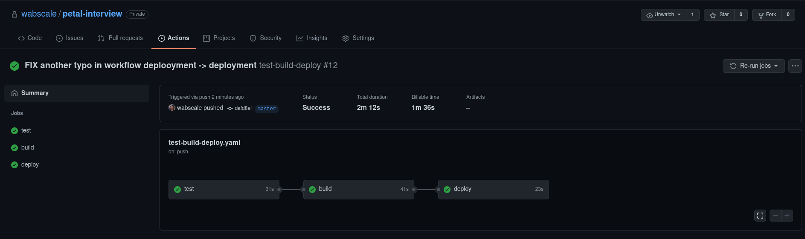
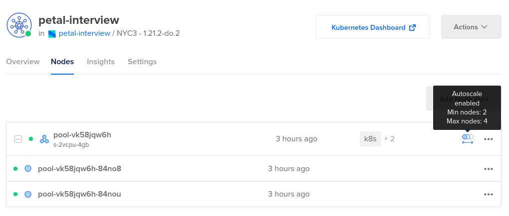

# Petal Interview

## Overview

The purpose of this assignment is to provide a simple API that reverses and capitalizes strings provided.
There is the added requirements that api.shoutcloud.io be used for capitalizing the string, and that the
deployment is automated (with CD/CI).

There are a bunch of things in the Makefile for things like debugging, provisioning, deploying and testing.

```text
Available make targets:
make debug              # Debug application (run app.py locally on port 5000)
make test               # Run application test (have the app running in another window)
make build-docker       # Build docker image
make debug-docker       # Debug docker image by running it locally
make debug-docker       # Debug docker image by running it locally
make lint               # Lint app.py with black
make requirements.txt   # pip-compile requirements.txt dependencies
make venv               # Generate a virtual environment for local debugging
make provision-k8s      # Provision the initial cluster with traefik and metric-server
make deploy             # Manually deploy things to the k8s cluster
make clean              # Clean local debug environment of artifacts

```

## Try it out

```shell
curl -XPOST --data '{"data": "test"}' -H 'application/json'  https://petal-interview.johncunniff.dev/
```

## Local Debugging & Testing

To debug this system locally I have a few targets in the makefile to get you up and started quickly.
Assuming you have virtualenv installed, you can get the app started quickly by running the debug make 
target with:

```shell
# Quickly get the app up and running in debug mode
make debug
```

That will create a virtualenv for you and start the api on [https://localhost:5000/](https://localhost:5000/).
You can then run the tests against your running api with the test target:

```shell
# Run the tests against the app running on port 5000
make test
```

The tests cover both making sure that good requests work, and that broken requests do not.

## The deployment

I decided to go with what I know which is kubernetes. This project is probably the perfect example
of an unnecessary k8s deployment, but here we are.

The k8s cluster is hosted on digital ocean using their managed kubernetes, and container registry.

The deployment itself is relatively simple. I use traefik with a load balancer for the ingress,
and have a k8s deployment for the api.

[](https://mermaid-js.github.io/mermaid-live-editor/edit##eyJjb2RlIjoiZ3JhcGggTFJcbiAgICB1c2VyW1VzZXJdIC0tPiB8dXNlciByZXF1ZXN0fCBsYihMb2FkIEJhbGFuY2VyKVxuICAgIGxiIC0uLT4gdHJhZWZpazFbVHJhZWZpa11cbiAgICBsYiAtLi0-IHRyYWVmaWsyW1RyYWVmaWtdXG5cbiAgICBzdWJncmFwaCBrOHMgY2x1c3RlclxuICAgIHRyYWVmaWsxIC0tPiBhcGkxW0FQSTFdICYgYXBpMltBUEkyXVxuICAgIHN1YmdyYXBoIG5vZGUxXG4gICAgICAgIHRyYWVmaWsxXG4gICAgICAgIGFwaTFcbiAgICAgICAgYXBpMlxuICAgIGVuZFxuXG4gICAgdHJhZWZpazIgLS0-IGFwaTNbQVBJM11cbiAgICBzdWJncmFwaCBub2RlMlxuICAgICAgICB0cmFlZmlrMlxuICAgICAgICBhcGkzXG4gICAgZW5kXG4gICAgZW5kXG4gICIsIm1lcm1haWQiOiJ7XG4gIFwidGhlbWVcIjogXCJkZWZhdWx0XCJcbn0iLCJ1cGRhdGVFZGl0b3IiOmZhbHNlLCJhdXRvU3luYyI6dHJ1ZSwidXBkYXRlRGlhZ3JhbSI6ZmFsc2V9)

## The CD/CI

Github actions seemed to be the reasonable choice for this situation.



[The actions workflow is very simple](.github/workflows/test-build-deploy.yaml). 
There are test, build and deploy steps. They are run sequentially so that
if one step fails, the others will not be run. This ensures that things are only deployed when the tests
pass.

#### Test step

In the test step, I start the webserver in the background and run the tests file using pytest.

#### Build step

In the build step, I log into the digital ocean container registry, build the image and push it off.

#### Deploy step

In the deploy step, I download and configure kubectl using a digital ocean action, then apply and rollout
a new deployment of the api.

## Reliability & Scaling

There are a few things in this deployment that increase its reliability.

On the kubernetes side of things I have:
- [rolling updates to reduce service degradation while deploying](k8s-deployment.yaml#L22)
- [Horizontal Pod Autoscalers to respond to automatically add new api pods under load](k8s-deployment.yaml#L149)
- [startup and readiness probes on api pods to ensure that requests are only routed to healthy pods](k8s-deployment.yaml#L67) 

Along with these I have the [traefik ingress configured to retry failed requests a certain number of 
times before failing](k8s-deployment.yaml#L114). The retry ensures that one off failed requests to shoutcloud do not cause a 
failed request.

I also use flask-caching as a super simple [cache in between the api and shoutcloud](app.py#L64). The caching ensures
that quick sequential requests are cached. It also removes some reliance on shoutcloud.

In digital ocean I also have the node pool for the kubernetes cluster set to scale up 
if there are resource pressure conditions. The resource pressure conditions may be things like
running out of memory or cpu.


 

## More to be done...

There are several things that could be done to improve this deployment. 

#### The cache
The cache could be greatly improved by moving from a non-persistent per pod filesystem cache 
to something with more global state like redis. flask-caching supports this backend, so really 
I would just need to put a redis on the cluster, and point the cache at it.

#### Helm chart
Raw k8s is only good up to a certain point. Putting the k8s yaml into a helm chart would be the
next thing I would want to do. Helm allows for the yaml to be templated, and configurable through a
values.yaml file. A chart would then make this project "helm installable", and therefore much more 
portable in the event that the system needed to be installed somewhere else.

#### Documentation Server / Generation
It would be good to provide clients of the api some kind of website that highlights the endpoints
provided. I would probably want to use something like flask-swagger as I have used it in the past.
That would make the API much more user friendly.


